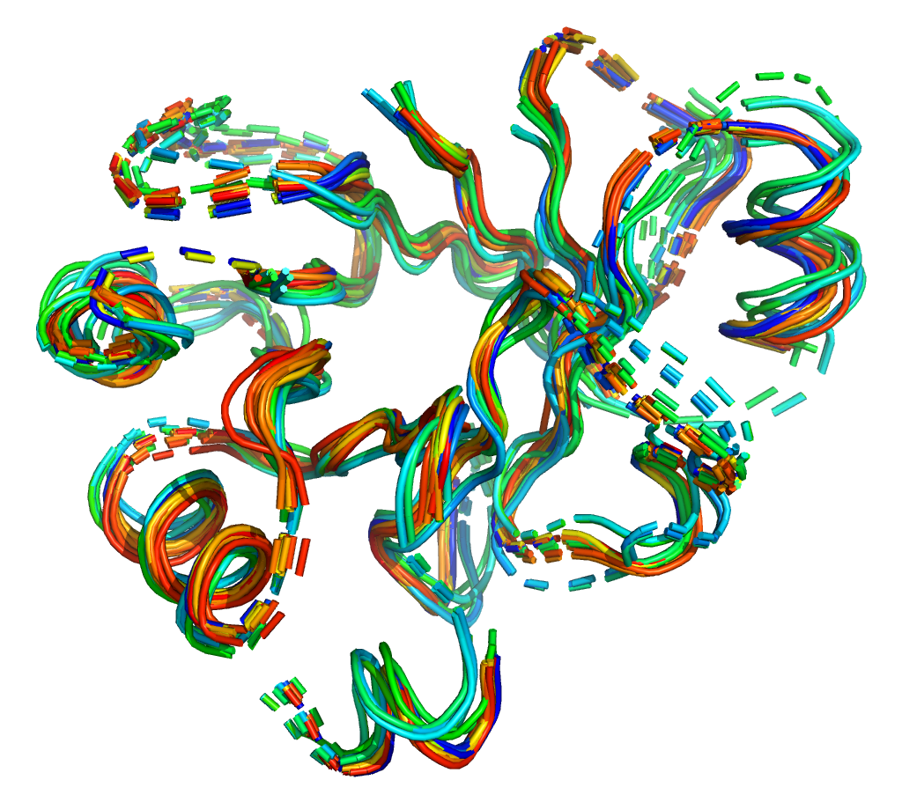

# BiologicalDataDS2020

Repository for Biological Data course project, Master Degree in Data Science at University of Padua.



## Requirements

All the required Python packages can be install executing the code

```
pip install -r requirements.txt
```

while inside the folder of the project.

All the remaining operations were executed using a Linux x64 machine, launching the _bash_ files inside the _data_ folder.

All the databases needed to execute the code were not included in the repository due to their size, and are hosted in this OneDrive folder: <https://1drv.ms/u/s!AqCB-obyBHqxhfwhorLjh3IIyPBAlA?e=VSBgFo>. After downloading them, place them inside the `data/part_2/original_datasets folder`.

To execute all the project to test all the computations, delete all the data in the `parsed` subfolders in `data/part_1/HMMs` and `data/part_1/PSSMs`.

## Structure of the Project

The main file of the project is `Project.ipynb`, in here all the steps we have done can be followed and executed again.

`report.pdf` contains an in-depth explanation of what was done during the project and in there will be the interpretations of our results.

In `code` can be found all the Python script used in the Jupyter notebook.

In `data` can be found all the files and bash script used and saved from the Jupyter notebook.
